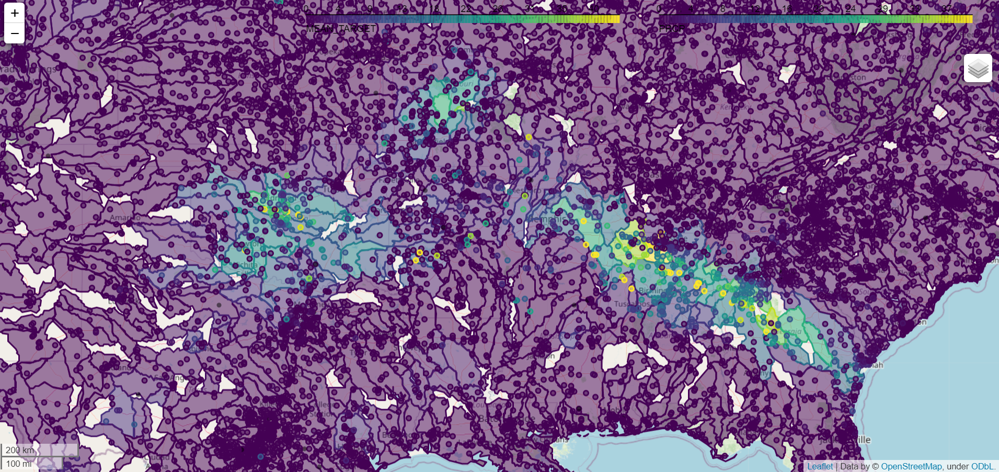
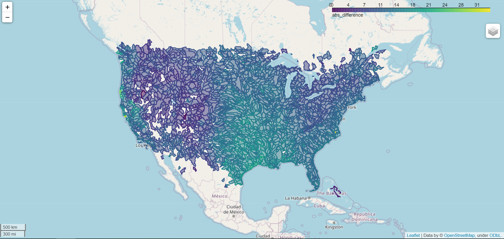
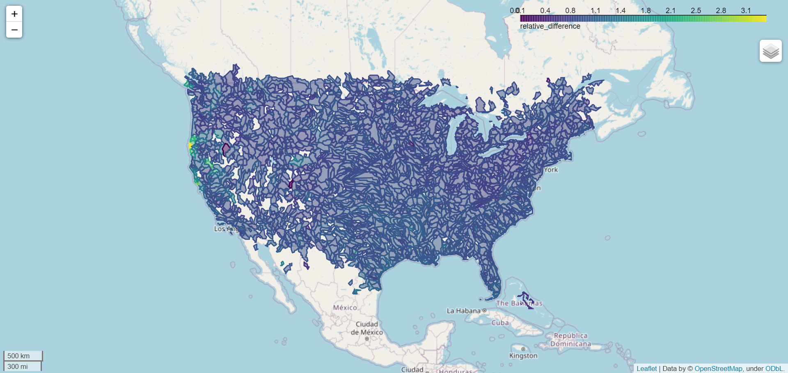

# Reor20 - Radar Precipitation Prediction

## Aim of the project

[Reor20](https://www.reor20.com/) is a company aiming to make flood risk analysis faster and cheaper by using machine learning (ML) instead of the more computationally intensive computational fluid dynamics (CFD).

The objective of this project was to create a ML model that can accurately predict the average rainfall occurring in any watershed of the conterminous United states from rain gauges data.

### Technologies 

- Python
- SQL
- geojson
- plotly, seaborn, matplotlib
- Pandas, numpy, google colab
- XgBoost
- Snowflake

## Introduction

**What is a watershed?**

A watershed or catchment is an area of land that drains or “sheds” water into a specific waterbody. Each watershed has rain gauges within its borders.

**What are rain gauges?**

Rain gauges are an instrument used by meteorologists and hydrologists to gather and measure the amount of liquid precipitation over a predefined area, over a period of time.

**How do I aim to predict the rainfall from rain gauges data?**

Rain gauges measure precipitation in a specific point of the watershed (point measurement), therefore the company is not sure that its information can be used to find the *average* precipitation over the whole watershed. That is why ML may be a good solution to the problem.

**What is the target variable for this ML problem?**

Radar date is considered to be a reliable source for measuring precipitation. It is used by Reor20 for their flood detection model, but it's a relatively new inventiona and its data doesn't go back in time that much, while rain gauges have been aroung for a much longer time.

## Available data

The company provided the following data:
- watersheds/catchments features: position and geographical/topografical information (size, mean altitude, altitude standard deviation, minimum altitude, maximum altitude, altitude range, altitude variace, number or rain gauges inside its border, centroid latitude, centroid longitude, mean slope, slope standard deviation, minimum slope, miximum slope, slope range)
- rain gauge features: name, elevation and position (latitude and longitude), watershed it belongs to.
- rain gauge measurements: name of rain gauge, date and measurement (in mm of rain)
- radar measurements: name of watershed, date and average measurement over the watershed (in mm of rain)

NOTE: the radar measurements span timewise from 2010 to 2021.

## Method

### Exploratory Data Analysis 

At first we performed an exploratory data analysis. To get a feeling of the spacial correlation between the rain gauges and the radat data measurements, I plotted the map of the US with both for two particular days. Below a snipped of the 1st of April 2015 is provided. The color of the watersheds represents the radar data (target) and the color of the points represent the rain gauges measurements.

We then proceeded to spacially visualize which the watersheds had a higher correlation between rain gauges and radar measurement by calculating the mean average difference between rain gauge and radar measurement over the whole time span (2010-2021). 

There was a clear difference between the plains and the more elevated regions of the US. However, if we divide each average difference by the amount of precipitation, we don't notice any clear separation between regions of the US: the more it rains, the lower the correlation between rain and radar measurement.

All of the html maps are available in the [Images section](/Images).

We analysed the difference between rain gauge and radar data depending on different variable (i.e. altitude of the rain gauge, altitude of the catchment, distance of the rain gauge to the center of the catchment etc). 
The notebook is available [here](/EDA).

### Models

From the model it was clear that the rain gauge measurement, even though not perfectly correlated, is the most important feature for the predictive model.

I tested the perfomance of two different models that I called:

- all rain gauge model
- aggregated statistics model

The *all rain gauges model* in the [Models folder](/Models) considers one 2x2 (latitude and longitude units) area and, to predict the radar data inside a certain catchment, uses the following features:

*   all of the rain gauge measurements of the area
*   the distance of every rain gauge to the center of the catchment the model is predicting on
*   aggregated statistics of the rain gauge measurements regarding the catchment the model is predicting on

*Why would I consider the rain gauges outside a catchment to predict the precipitation inside the catchment?*

It happens sometimes that the rain gauges data and the radar data are not correlated. This can be caused by the fact the precipitation is localized in parts of the catchment where no rain gauge was present. By considering the rain gauges of the entire 2x2 area, I was hoping for the model to learn the general pattern of a precipitation and increase the prediction score.
The model was trained on various areas of the US south-east and performs with an average score of around 0.5 R2. To obtain a decent score, a sufficient 
number of colums and rows needs to be used. Every area has a different number of rows and colums because the number of rain gauges changes and the number of 
measurement days also changes.

The **aggregated statistics** model in the [Models folder](/Models) also considers one 2x2 (latitude and longitude units) area and, for each day, computes some aggregated statistics of the rain gauge measurements about the catchment the model is predicting on and the whole 2x2 area. As aggregated statistics I used: 
*   Minimum
*   Maximum
*   Mean
*   Median
*   Quantiles (every 10%)

Multiple 2x2 areas have been considered. Every area's dataframe was concatenated into a unique one, obtaining a dataframe with 2M rows. 
The final score was not impressive: around 0.30 R2.

